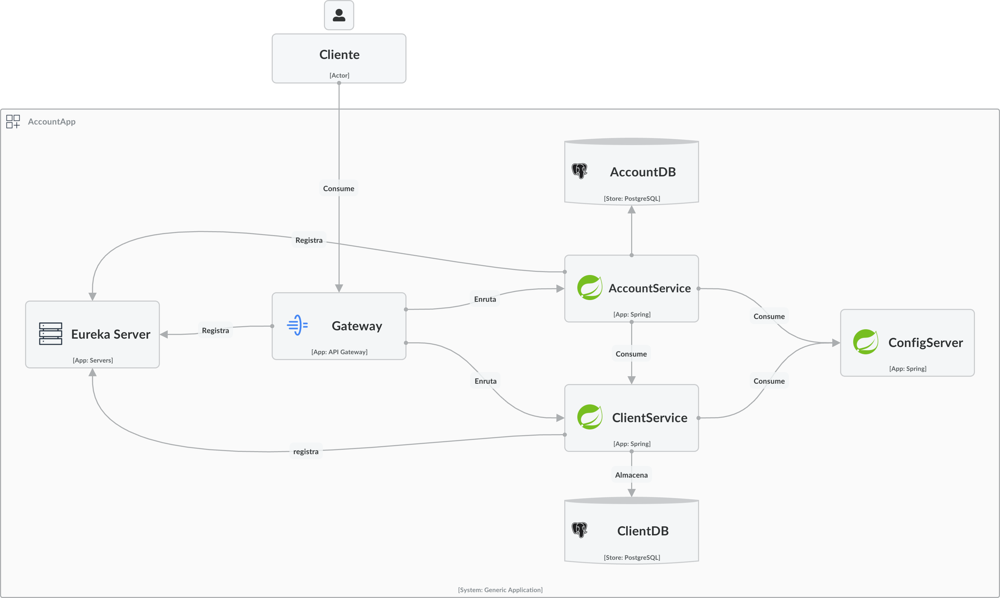
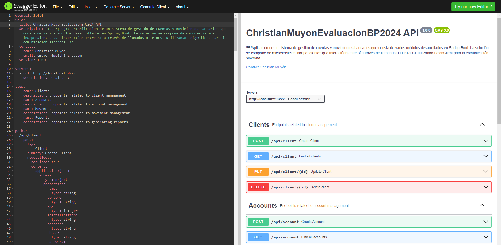

# Aplicación de Gestión de Cuentas y Movimientos

Esta aplicación es un sistema de gestión de cuentas y movimientos bancarios que consta de varios módulos desarrollados en Spring Boot. La solución se
compone de microservicios independientes que interactúan entre sí a través de llamadas HTTP REST utilizando `FeignClient` para la comunicación
síncrona.

## Instrucciones para levantar la aplicación localmente y con Docker Compose

### Prerrequisitos

1. **Java 17** instalado en su máquina.
2. **Maven** o **Gradle** instalado para compilar los proyectos.
3. **PostgreSQL** instalado y en funcionamiento en los puertos especificados en la configuración de cada servicio.
4. **Configuración de Base de Datos**:
    - Crear bases de datos para los módulos `accounts` y `clients`.
    - Configurar la conexión de la base de datos en cada módulo en el archivo `application.yml` o `application.properties`.

### Pasos para levantar cada módulo

Siga estos pasos para levantar cada módulo en el orden que se indica a continuación:

#### 1. Config Server

Este módulo proporciona la configuración centralizada para otros servicios.

- Ir al directorio `config-server`.
- Ejecutar el siguiente comando para compilar y ejecutar el módulo:
  ```bash
  ./gradlew bootRun
  ```
- El servicio estará disponible en `http://localhost:8888`.

#### 2. Discovery Server

Este módulo utiliza Eureka Server para el registro de servicios.

- Ir al directorio `discovery`.
- Ejecutar el siguiente comando para compilar y ejecutar el módulo:
  ```bash
  ./gradlew bootRun
  ```
- El servicio estará disponible en `http://localhost:8761`.

#### 3. Accounts Service

Este módulo gestiona las cuentas bancarias y se registra en el Discovery Server.

- Ir al directorio `accounts`.
- Ejecutar el siguiente comando para compilar y ejecutar el módulo:
  ```bash
  ./gradlew bootRun
  ```
- El servicio estará disponible en `http://localhost:8081`.

#### 4. Clients Service

Este módulo gestiona los clientes bancarios y se registra en el Discovery Server.

- Ir al directorio `clients`.
- Ejecutar el siguiente comando para compilar y ejecutar el módulo:
  ```bash
  ./gradlew bootRun
  ```
- El servicio estará disponible en `http://localhost:8082`.

#### 5. Gateway

El Gateway actúa como una puerta de entrada para los clientes y enruta las solicitudes a los servicios correspondientes.

- Ir al directorio `gateway`.
- Ejecutar el siguiente comando para compilar y ejecutar el módulo:
  ```bash
  ./gradlew bootRun
  ```
- El servicio estará disponible en `http://localhost:8080`.

### Verificación

- Puede acceder al Discovery Server en `http://localhost:8761` para ver todos los servicios registrados.
- Puede utilizar herramientas como `Postman` para probar las API de cada servicio a través del Gateway en `http://localhost:8080`.

### Instrucciones para levantar la aplicación utilizando Docker Compose

#### Prerrequisitos

1. **Docker** instalado y funcionando.
2. **Docker Compose** instalado.

### Pasos para ejecutar la aplicación con Docker Compose

#### 1. Crear redes de Docker

Primero, cree las redes necesarias para la comunicación de los servicios.

```bash
docker network create spring
docker network create postgres
```

#### 2. Construir las imágenes de Docker

Navegue al directorio raíz del proyecto y ejecute el siguiente comando para construir todas las imágenes de Docker.

```bash
docker-compose build
```

Este comando construirá las imágenes de Docker de todos los módulos (config-server, discovery, accounts, clients, gateway).

#### 3. Iniciar los contenedores de Docker

Ejecute el siguiente comando para iniciar los contenedores:

```bash
docker-compose up
```

Este comando levantará todos los contenedores de los servicios definidos en el archivo `docker-compose.yml`.

#### 4. Verificar los servicios

- **Config Server**: `http://localhost:8888`
- **Discovery Server**: `http://localhost:8761`
- **Accounts Service**: `http://localhost:8081`
- **Clients Service**: `http://localhost:8082`
- **Gateway**: `http://localhost:8080`

### 5. Detener los contenedores de Docker

Para detener los contenedores y eliminar las redes creadas, ejecute:

```bash
docker-compose down
```

### Notas adicionales

- Asegúrese de que los puertos necesarios estén disponibles y no en uso por otros servicios.
- Verifique los archivos de configuración en cada módulo para asegurarse de que las conexiones a la base de datos y otros servicios sean correctas.

¡Con esto, la aplicación debería estar funcionando correctamente tanto en modo local como en contenedores Docker!

## Diagrama de componentes la solución

Puedes ver el diagrama de componentes de la arquitectura en IcePanel <a href="https://s.icepanel.io/JMDj0OpEMLBwov/f7Hd" target="_blank">aquí</a>.



## Probar los Servicios con Postman

En la ruta principal del proyecto, existe un archivo llamado `ChristianMuyonEvaluacionBP2024.postman_collection.json` que contiene una colección de
pruebas para todos los métodos de los servicios. Puedes importar este archivo a Postman para probar los endpoints de manera fácil.

## Documentación del API

La documentación completa de los endpoints de la API está disponible en el archivo `swagger.yml` ubicado en la ruta principal del proyecto. Este
archivo sigue el formato de OpenAPI y puede ser utilizado para explorar y probar los endpoints de la aplicación con herramientas compatibles con
Swagger, como Swagger UI o Postman.

